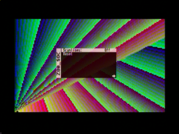
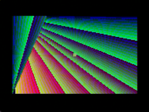
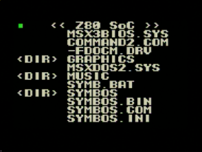
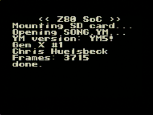
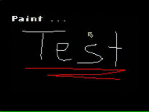

What is this?
-------------

Each lesson presented here explains a single aspect of the MiST
board. The lessons are not VHDL or Verilog tutorials. Instead the
lessons include all files required to build demo setups for the MiST
board. They come with compiled and synthesised binaries so you can
test run them before getting into the details.

Each lesson focuses on one aspect like the VGA output, then SDRAM, the
SD card etc etc. Most lessons use a VHDL Z80 CPU and implement a small
but fairly complete system on a chip (SoC) which can be used to
experiment with the lessons. But it can also be used as a basis for
bigger systems.

The intended audience of this are people who already have some basic
VHDL or Verilog knowledge and know how to use a tool like Quartus and
who want to learn how to use the various peripherals on the MiST
board.

Unless otherwise stated all code included comes without restrictions
and you can re-use it in any way be it for closed source or open
source projects. Most included third party code (T80, YM2149, PS2)
comes under GPL or simimlar license and may e.g. not be used closed
source projects or the like. Please have a closer look at the files
you intend to re-use for your project

(Lesson 1)[https://github.com/mist-devel/mist-board/tree/master/tutorials/soc/lesson1] A VGA controller
--------------------------

A 160x100 pixel VGA controller based on the 640x400@70Hz VGA mode. A
simple b/w checkerboard is being displayed. The Video clock of 25.175
MHz is generated from the 27 MHz system clock using a PLL.

The VGA controller mainly consists of the two counters, one to count
the pixels per line (h_cnt) and one counting lines (v_cnt). Both
counters are used to generate the horizontal and vertical sync signals
and to determine the time where pixels are to be displayed. The
horizontal counter is directly updated by the pixel clock. The
vertical counter is updated once per line only.

The VGA controller has six output bits per color. On the MiST board
these are fed into a resistor ladder (r2r) which is used as a digital
analog converter to generate the analog video signals. Six bits are
sufficient for 2^6=64 shades per color resulting in a total of 262144
colors in total. Using PWM techniques more colors are
possible. E.g. the Amiga AGA core does that. This demo however just
displays a black'n white checkerboard.

Links:
 - https://eewiki.net/pages/viewpage.action?pageId=15925278

Files required on SD card: 
 - soc.rbf renamed to core.rbf
 - [soc.rbf](https://github.com/mist-devel/mist-board/raw/master/tutorials/soc/lesson1/soc.rbf) renamed to 'core.rbf'

Lesson 2: Video memory and embedded ROM
---------------------------------------

The VGA controller is now being equipped with 16000 bytes of embedded
FPGA RAM as video memory (VMEM/VRAM). The resulting video controller
can display 256 colors in RGB 332 format (3 bits red, 3 bits green, 2
bits blue). A demo image is placed into an embedded ROM and copied
into screen memory at start up.

The graphics needs to be in 160x100 pixels in RGB332 format. The
img2hex.sh shell script uses the Linux tool "avconv" (on older distros
it may be named "ffmpeg") to generate a matching raw image from a
160x100 pixel PNG image. The resulting raw image is exactly 16000
bytes in size. img2hex.sh then calls the srec_cat to convert this into
intel hex format.

The ROM has been generated using Quartus' Megafunction wizard. It allows
to specify a intel hex file as the data source for the ROM.

Files required on SD card: 
 - soc.rbf renamed to core.rbf

Lesson 3: Z80 CPU and RAM
-------------------------

The T80 Z80 CPU core is being added. 4 kilobytes of RAM are added for
the CPU as well as 4 kilobytes of ROM. ROM and VRAM share the same
memory region as ROM is read only and (our) VRAM is write only. On
most systems video memory can be read and written which is quite
useful when altering video contents. In our SoC we implement the video
memory write only which is not the usual way to do it. But a platform
like an FPGA allows us to do this and if it turns out to be a bad idea
we can easily change this. But being able to map VRAM and ROM to the
same address space makes efficient use of the 64k address space the
Z80 CPU offers.

The CPU is clocked at 4 Mhz which is additionally to the VGA clock
generated by the existing PLL.

The ROM contents are compiled from a C source using the SDCC compiler
(http://sdcc.sourceforge.net). SDCC generates a intel hex file which
is directly included into the ROM by Quartus' Megafunction wizard like
the image data in lesson 2.

All memory is decoded only partially which means that the 4k ROM at
address 0x0000 is mirrored 7 times in the lower 32k memory area
(A15=0). The ROM shows up at addresses 0x0000-0x0fff, 0x1000-0x1fff,
0x2000-0x2fff, 0x3000-0x3fff, 0x4000-0x4fff, 0x5000-0x5fff,
0x6000-0x6fff and 0x7000-0x7fff. The 16000 bytes video of video memory
is mapped twice and can be written at address 0x0000-0x3ef7 and
0x4000-0x7e7f. Finally the 4K RAM is mapped to the upper half of the
address space (A15=1) and can be read and written at 0x8000-0x8fff,
0x9000-0x9fff, 0xa000-0xafff, 0xb000-0xbfff, 0xc000-0xcfff,
0xd000-0xdfff, 0xe000-0xefff and 0xf000-0xffff. The SDCC compiler by
default uses 0xffff for the stack going downwards and it used the
memory region from 0x8000 for global variables. The aforementioned
mirroring allows to use the default SDCC memory layout with only 4k
RAM. We can do this as long as we don't need the address space for
other purposes.

The test program is a simple graphics demo. It doesn't use any global
variables but uses the stack for local variables. Thus the running
demo shows that ROM as well as RAM are working as well as the video
memory, of course.

Links:
 - https://de.wikipedia.org/wiki/Zilog_Z80
 - http://sdcc.sourceforge.net/

Files required on SD card: 
 - soc.rbf renamed to core.rbf

Lesson 4: SDRAM
---------------

So far we've been using FPGA internal embedded RAM. This is very easy
to implement and use and incredibly fast. Unfortunately there's only a
little more than 70 Kilobytes of embedded memory available inside the
MiST's FPGA. Therefore the MiST comes with additional 32MBytes
SDR-SDRAM.

SDR-SDRAM is a more modern memory type than the DRAM that was used in
the homecomputer age. But it's also significantly older than the
latest DDR4/5-SDRAM memories todays computers use. The latest memory
types can be very fast under certain conditions but are very complex
to control. The usage of SDR-SDRAM was a useful tradeoff between speed
and ease of use. Furthermore modern RAMs don't match the retro
requirements very good.

The MiST comes with a 133MHz 16 bit wide SDR-SDRAM. This means that
the RAM can be clocked at up to 133 Mhz and that it transfers 16 bits
(two bytes) at once. A SDR-SDRAM uses a synchronous protocol to access
its contents unlike DRAM which was asynchronous. In the first access
stage (RAS cycle) a part of the desired address information is sent
into the SDRAM. After a certain pause the second half of the address
information (CAS cycle) is sent to the SDRAM and finally after another
pause the data itself can be read or written. The lengths of these
pauses depend on certain SDRAM parameters and on the clock that's
actually being used to access the SDRAM.

On the MiST a typical single SDRAM transfer requires 8 clock
cycles. Thus the SDRAM is typically clocked at 8 times the CPU clock
so the SDRAM can perform a full access cycle during one CPU
cycle. Since the CPU is clocked at 4 Mhz in our SoC the SDRAM is
clocked at 32Mhz. The 32Mhz are again generated by our PLL and the
4Mhz are now derived from the 32Mhz by dividing it by 8.

There is a counter "q" inside the SDRAM controller sdram.v which
permanently counts from 0 to 7. This counter synchronizes itself to the
CPU clock to make sure the counter always starts with 0 at the begin
of a CPU cycle. When running at 32Mhz and with one full memory
transfer every 8 cycles the resulting total access time is 250ns. This
was a typical RAM access rate in the age of home computers. The SDRAM
supports a clock of 133Mhz and thus access times of ~60ns are
possible. Special burst access modes of the SDRAM can be used to read
more than 16 bits in one access cycle. But these must be consecutive
memory contents and require a CPU to have caches to increase the
system performance. Retro CPUs usually don't have that. The limit for
single random accesses is ~60ns (this is actually still the same with
modern DDR RAM).

The SDRAM has a 16 bit data bus but our SoC is a 8 bit system. We thus
simply ignore one half of the data bus. As a result only 16 of the 32
MBytes can be addressed. This is still much more than the Z80 can
easily handle. The Z80 has a 16 bit address space giving a total of 64
kBytes directly accessible memory. The SoC is currently using the
upper half of this for RAM. Thus only 32 kBytes of the SDRAM is
actually being used. It would be possible to implement banking or the
like to give the Z80 access to more memory. But this requires special
support in the software which we'd like to avoid.

SDRAMs need to be initialized before they are fully operational. The
sdram.v contains a simple logic to do this once the PLL reports that
it's generating stable clocks via its locked signal. The CPU is being
kept in reset a little longer to make sure the SDRAM is ready once the
CPU starts running.

The SDRAM timing is quite critical. One result of this is that a
second 32Mhz clock is generated by the PLL with a small offset (phase
shift) of -2.5ns. This clock is fed into the SDRAM. This makes sure
that the FPGA and the SDRAM aren't changing signals at exactly the
same time. Instead one of them changes signals on one clock and the
other component sees stable signals when it's own slightly shifted
clock changes.

Further stability is added by the soc.sdc constraints file. This tells
Quartus about timing critical signals. Quartus will then make sure
these signals need to be connected in a way that they have a minimum
delay.

Files required on SD card: 
 - soc.rbf renamed to 'core.rbf'

Lesson 5: OSD and User_IO
-------------------------

The MiST comes with a separate ARM microcontroller (IO
controller). The main purpose of this controller is to load the FPGA
config from SD card at power on and to configure the FPGA with
it. During run time the ARM controller is idle.

So far our core didn't receive and user input. Actually the FPGA isn't
connected to any input device. All the joystick ports, USB ports and
the buttons are connected to the ARM IO controller and it can do all
the complex tasks like e.g. doing all the USB handling which retro
machines cannot do as USB didn't exist at that time.

The IO controller and the FPGA are connected by a SPI connection.  The
files user_io.v and osd.v implement exactly the type of SPI client the
IO controller expects to use. You typically don't have to care much
about these two files. You just include them into your projects and
let them do their job. User_io.v receives all kinds of events related
to user interaction. It thus always knows if the user pressed a key on
the keyboard, moved the mouse or used a joystick. The file osd.v can
intercept VGA signals and include a small image (on screen display,
OSD) into the video stream. The contents of this small image are
received from the IO controller. Also the IO controller can show and
hide the on screen display. Both files (user_io.v and osd,v) together
can provide the well know OSD that you can open in most cores via F12.

The osd.v needs to be integrated into the video data path. VGA signals
from out VGA controller are thus not connected to the MiSTs VGA
outputs anymore. Instead they are connected to the inout signals of
osd.v. The outputs of osd.v are in turn connected to the MiSTs VGA
outputs.

The file soc.v contains a small config string including the cores name
("Z80_SOC") and information about entries the core would like to have
displayed in the on screen display. The IO controller reads this in
order to control the contents of the OSD. In the soc.v this is a
option entry named "Scanlines" which can be switched "On" or "Off" and
a toggle signal named "Reset" which is activated for a few
milliseconds whenever the user selects this in the OSD.

The state of both OSD entries is returned into the core through status
byte signals of user_io.v. Bit 0 of this byte has a fixed meaning and
goes high whenever the IO controller wants to restart the core
(e.g. when it is rebooting itself or when it just uploaded a new
core). The other bits of the status byte are controlled by the IO
controller depending on the state of the OSD. In out SoC status[1]
represents the state of the "Scanlines" option in the OSD and
status[2] indicates whether the user selected "Reset" from the OSD.
The status[1] signal is fed into the vga controller to enable or
disable the scanlines effect.

Files required on SD card: 
 - soc.rbf renamed to core.rbf

Lesson 6: ROM upload, IRQs
--------------------------

Storing ROM contents inside the Core also consumes a lot of internal
FPGA memory. It also requires the whole core to be rebuilt for every
change of the ROM contents.

The MiSTs IO controller provides a simple helper mechanism for
this. Whenever it uploads a new core it will read the cores config
string incl. the cores name. It will then add ".rom" to this name and
check whether it finds a file with that name on SD card. In case of
the Z80 SoC it searches for a file named "Z80_SOC.ROM". If it finds
one it sends it via SPI to the FPGA. On FPGA side the file "data_io.v"
takes care of this. It activates a signal named "downloading" and
delivers all bytes received from the IO controller one by one. It also
generates a write signal and an address for this which can both be
directly connected to a RAM.

To save even more FPGA internal memory we now also use SDRAM for the
ROM area. Thus data_io.v writes into SDRAM. While the download is
progressing the CPU is kept in reset and it's being disconnected from
the SDRAM. Once the download is complete the data_io.v is disconnected
from the SDRAM and the CPU is re-connected and its reset is being
released. The CPU will then start executing the ROM contents which
have now been placed in SDRAM. Now 64 kBytes of SDRAM are used in
total.  The first 32kBytes are used as ROM and the the second 32kBytes
as RAM together making use of the entire 64k address space of the Z80.

In order to boot successfully the file z80_soc.rom must from now on be
placed on the SD card.

To make the software a little more interesting as well this version
implements a vsync interrupt. An interrupt is an external signal that
causes the CPU to stop whatever it's doing and to execute a certain
function. The Z80 CPU in interrupt mode 1 will read a pointer from
address $38 whenever it notices that its interrupt pin is being driven
low. Subsequently it will execute the code stored at that position
until the function returns causing it to continue whatever it did
before. Unfortunately there is no easy way to tell the SDCC compiler
to set the pointer at address $38. Instead its default startup code
will always install an empty interrupt handler there. The file
irqvec.s is thus needed to trick the SDCC compiler into setting the
interrupt vector without modifying the SDCC's startup code. This is by
no means an elegant solution but it works. I am sure better solutions
for this exist ...

In the interrupt handler the 16 pixels in the center of the screen are
drawn using changing colors.

The OSD also allows to manually select ROM files from SD card. Many
game console cores allow this. The data_io.v generates an index signal
which indicates whether the ROM download is the initial download the
SoC also uses (index = 0) or if the user triggered the download via
OSD (index = OSD line which was used to start the download). The SoC
does not use this feature (yet). The ZX01/ZX81 core uses the same
feature to upload cassette tape images which are then replayed through
the audio circuitry internally after upload.

Files required on SD card: 
 - soc.rbf renamed to core.rbf
 - z80_soc.rom

Lesson 7a: SD card 
------------------

Many retro systems use mass storage devices like floppies and tapes.
These aren't available on the MiST. Instead the MiST comes with an SD
card. SD card interfaces for many retro systems exist like e.g. 
the "divmmc" device for the ZX spectrum or the SD2IEC for the C64.

On the MiST the SD card is connected to the IO controller and not to
the FPGA. To cope with this fact the file "sd_card.v" implements a SD
card inside the FPGA. sd_card.v behaves itself like an SD card in SPI
mode and sends and receive SD card contents from the real SD card
connected to the IO controller. It only implements a subset of the SD
card commands but all systems tested so far only use this subset.

The file sd_card.v has several connections to the user_io.v to send
and receive data to and from the IO controller. The four signals sd_cs,
sd_sck, sd_sdi and sd_sdo can be used by the rest of the core to access the
sd_card just like a real sd card.

In order to make any use of the SD cards contents the core needs to
implement a file system driver. This is a piece of software that
understands how data is stored on an SD card and e.g. reads files and
directories. The petit fat file system (pffs,
http://elm-chan.org/fsw/ff/00index_p.html) is such a file system
driver software. In order to use it we have to include all the source
files into our firmware and call the required functions from our main
routine in boot_rom.c. Also we need to implement a software component
that allows pffs to read sectors from the SD card. The pffs web page
provides a sample archive which contains a generic SD card driver in
mmcbbp.c. We've done minimal modifications to this to allow it to
access a few GPIO pins inside the FPGA. These are mapped into the Z80
IO memory area.

As a result the z80_soc.rom is able to access the SD card and list
it's contents.

Files required on SD card: 
 - soc.rbf renamed to core.rbf
 - z80_soc.rom
 - other files to show up in the directory listing

Lesson 7b: Hardware SPI
-----------------------

The previous SD card integration used "bit banging" to let the Z80
control the SPI connection to the SD card. This works but is really
REALLY slow as the Z80 CPU needs to execute several instructions for
every single bit it receives as it needs to control every single
change of the clock and data signals going to the SD card. This is
easy to implement in hardware as it just needs two output bits for
sd_cs, sd_sck and sd_sdi and an input bit for sd_sdo and it's easy to
use in software as only minimal changes over the generic code example
is required. But it's too slow to be useful.

Since we can easily implement support hardware in the FPGA it's
possible to implement a hardware SPI master peripheral that can then
be used by the Z80. Spi.v implements this. The file mmc.c also needs
to be modified to make use of the new hardware. Sending a byte to the
SD card now requires only one Z80 instruction. As a result accessing
the SD card got significantly faster. 

An additional sector buffer inside mmc.c reduces the number of SD card
accesses and further increases speed. The resulting setup has a
sufficient performance to be useful.

Files required on SD card: 
 - soc.rbf renamed to core.rbf
 - z80_soc.rom
 - other files to show up in the directory listing

Lesson 8: Audio
---------------

The MiST has two single bit audio channels. This can be used to output
some simple square wave by just switching the outputs on and off at the
desired frequency. A better sound can be achieved by using PWM
techniques like sigma delta conversion. This is what most retro cores
for the MiST use to implement audio output.

This lesson adds an existing YM2149 audio chip implementation to our
SoC. This is the same audio chip the Atari ST uses as well as some
versions of the ZX spectrum or some arcade machines used. The ym2149
is controlled via two registers which are mapped to the Z80's IO space
at address 0x10 and 0x11.

Sounds for the ym2149 can be stored in ym files. These are direct
records of Atari ST sounds and simply store the whole ym2149 register
set at a 50 hz rate. Unfortunately most of these files use a format
that is rather inconvenient for streaming as whole file is compressed
and the bytes inside the files have been reordered to achieve better
compression. For our simple SoC setup we need the files uncompressed
and in linear order. Any YM file from the internet can be uncompressed
using the LHA program. Additionally the tool "ym_deint.c" included
with this lesson can undo any byte reordering. A ready decoded file
"song.ym" is also included with the lesson.

The 8 bit output of the ym2149 is fed into a sigma delta converter in
order to be fed into the single bit output of the MiST.

With the SD card implementation from the last lessons the song.ym file
can be read from the card and replayed as it is being read. This way
even those files can be replayed that would be too large to be stored
completely in the Z80's memory.

The replay routine itself is placed inside the Z80 interrupt handler
allowing for seamless playback even while SD card accesses take
place. In the previous lessons the interrupt was connected to the VGAs
vsync signal resulting in 60 interrupts per second. This doesn't match
the intended 50Hz playback rate of YM files. Therefore this lesson
connects the Z80's interrupt input to a counter which generates a 50Hz
signal from the 4 Mhz CPU clock by dividing it by 160000.

Links:
 - http://www.ym2149.com/ym2149.pdf

Files required on SD card: 
 - soc.rbf renamed to core.rbf
 - z80_soc.rom
 - song.ym

Lesson 9: Keyboard & Mouse
--------------------------

The MiST uses USB to connect mice and keyboards. USB is a rather
complex protocol and requires a lot of communication and message
parsing to detect even a single key press on a keyboard. The focus of
the MiST board lies on the implementation of retro machines of the
homecomputer age. At that time USB didn't even exist. That's why the
MiST board tries to hide all the complexity of USB from the FPGA
developer. All USB related communication is handled by the ARM
controller which in turn simply reports keyboard and mouse events to
the core via the SPI connection.

Many of the 8 bit cores available for the MiST were ported from the
FPGA development boards on which they were initially developed. These
boards typically bring a PS2 keyboard and/or mouse
connector. Therefore most existing FPGA projects expect to directly
connect to a PS2 mouse or PS2 keyboard. To ease porting of such
projects the MiST boards user_io.v implements two PS2 interfaces of
which one behaves like a mouse and one behaves like a keyboard.

This lesson uses a PS2 protocol decoder taken from Mike Sterlings ZX
Spectrum core which was developed to be used on the Terasic DE2. This
decode re-assembles the PS2 bitstream into bytes
(http://computer-engineering.org/ps2protocol/). Those bytes are then
parsed either by a ps2 mouse parser
(http://www.computer-engineering.org/ps2mouse/) and a keyboard parser
(http://computer-engineering.org/ps2keyboard/).

Two keys (SPACE and 'C') are decoded and detected in hardware in
keyboard.v. The resulting two bits are made available to the Z80 CPU
via a IO port.

The mouse movement is decoded in mouse.v. The movement is accumulated
in two other IO registers and made available to the Z80 CPU. Whenever
the CPU reads these registers the hardware counters are cleared to
restart accumulating new movement information.

The Z80 CPU simply takes this information and uses it to update two
variables keeping track of the mouse position. This position is used
to draw to the video memory whenever a mouse button is pressed. 

To allow the user to see where the mouse currently is requires a mouse
cursor to be drawn. This is where our write-only video memory causes
trouble as moving a mouse cursor on screen requires to read the pixels
"under" the mouse cursor in order to be able to restore them if the
mouse is moved to another spot. Our VGA controller simply doesn't
allow this. To circumvent this the VGA controller has been updated to
implement a hardware cursor. This curser is drawn by the VGA
controller itself. A further advantage of this is that the Z80 CPU
doesn't have to do any complex painting as it would with a software
cursor. This is very similar to the hardware sprites the C64
supported. This way of offloading CPU intense tasks into the hardware
can reduce the CPU load significantly.

Files required on SD card:
 - soc.rbf renamed to core.rbf
 - z80_soc.rom
